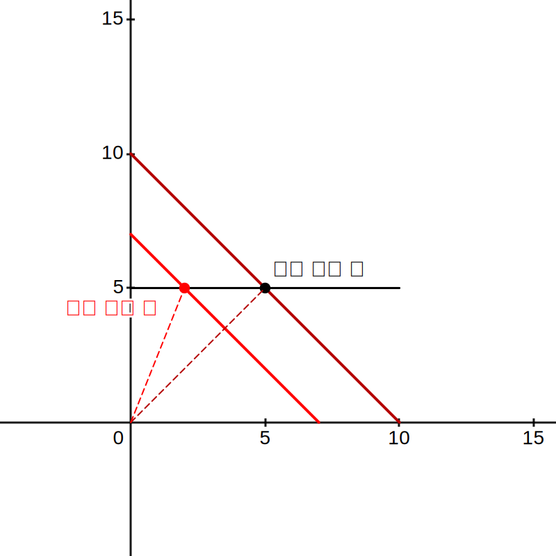

# Big todos

1. 헌법 300제 완성하기 : 전반 완성
2. 경제학 킬러 완성하기
    -> 스크롤 기능?
    -> (스와이프) 
3. 신판례 적어넣기
    -> 무조건 조항이라고 적었는데 사건에 불과할 수도 있으니 주의하자. 다만 크게
    중요한 건 아니니 나중에 수정하자.
4. 경제학 이유 명기하기

# Todos

0. 다크 모드 호환 css 변수 설정하기 주로 border color 때문
    -> 현재로서는 다크 모드에 최적화되어 있음.
    -> media="(prefers-color-scheme: dark) 를 활용하여 제대로된 호환성 챙기기
    [제대로 된 다크모드 이미지 인버트 방법](https://stackoverflow.com/questions/74638826/alternate-images-based-on-users-color-preference-without-using-javascript)
0. Popup 로직 모던화하기
    -> 현재로서는 윈도우에 엮어 있는데, 이렇게 할 게 아니라, 투명 디스플레이를 만들어서 거기에 이벤트 트리거를 넣는게 좀 더 모던하고 UX 친화적이다. 
    --> 다만 현실적으로 중요도가 크지는 않다. 약간의 퍼포먼스 로스트가 있는데, 지금 시간을 너무 많이 썼다... 지금은 공부하자.
1. 이유 명기하기 : 천천히 하자... 오래 걸리겠네
0. 이유 팝업에 정다보 같이 표기하자. 껏다켰다 하기에는 너무 귀찮다.
2. 그래프가 많이 필요한데, 데스모스는 너무 느리고, 리눅스판에서 계속 잉크스케이프가 튕긴다 개시발.

# MISC

설명 안에 다음 태그를 넣어 이미지 첨부 

```

```

# Backup

```
function show_hint(e) {
	let hint_container = document.getElementById("popup-hint-window");
	hint_container.style.setProperty('visibility','unset');
    console.log(hint_container.dataset.index)

	if (hint_container.dataset.index !== e.index ) {
        console.log("SAD");
        let answer = e[answerMap[e.answer]]
        console.log(answer);
		hint_container.children[0].innerHTML = `${e.index}. ${e.problem} :: ${answer}<br class="long-br"/>${e.explanation}`;
		hint_container.dataset.index = e.index 
	} 
```
